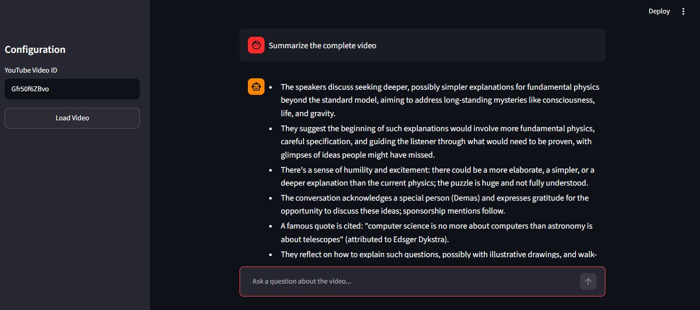

# 🎬 YouTube Transcript RAG Chatbot

An interactive, Retrieval-Augmented Generation (RAG) conversational agent built with Streamlit and LangChain. This application allows users to input any YouTube video ID, dynamically extracts its transcript, builds a vector search index using FAISS, and enables real-time context-aware chats regarding the video's content.

## 🚀 Features
* **Automated Transcript Extraction:** Bypasses manual copy-pasting by directly fetching YouTube closed captions.
* **Smart Chunking & Embedding:** Uses `RecursiveCharacterTextSplitter` and OpenAI's `text-embedding-3-small` to semantically chunk and index video data.
* **Contextual Memory:** Maintains continuous chat history within the session state, allowing for natural follow-up questions and pronoun resolution.
* **Clean UI:** Professional, responsive chat interface built natively with Streamlit.

## 🛠️ Tech Stack
* **Frontend:** Streamlit
* **AI/LLM:** OpenAI (`gpt-4o-mini`), LangChain (LCEL)
* **Vector Database:** FAISS
* **Data Ingestion:** YouTube Transcript API

## ⚙️ Installation & Setup

1. **Clone the repository**
   git clone [https://github.com/yourusername/yt-rag-chatbot.git](https://github.com/yourusername/yt-rag-chatbot.git)
   cd yt-rag-chatbot

2. **Install the required dependencies**
   pip install streamlit youtube-transcript-api langchain langchain-openai langchain-community faiss-cpu python-dotenv
    
3. Configure Environment Variables
   Create a .env file in the root directory and add your OpenAI API key:
   OPENAI_API_KEY=your_actual_api_key_here

4. Run the Application
   streamlit run app.py